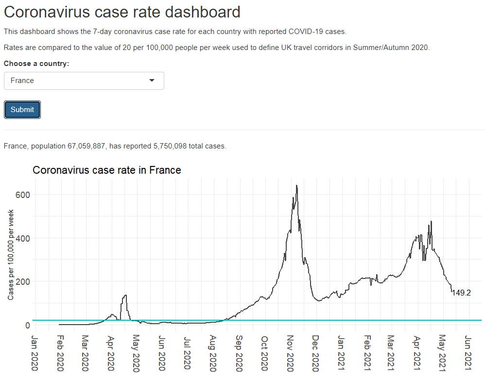

# COVID-19 case rate dashboard

### Introduction
This dashboard was created to monitor the 7-day COVID-19 case rate in different countries, in order to see which countries might be likely to be added to or removed from the UK's "travel corridor" list during Summer/Autumn 2020. Presence on the travel corridor list was reported to be based on a 7-day case rate of below 20 per 100,000 people per week, but there were no tools easily available showing these rates.

### Data
* Country names and ISO2/ISO3 codes were downloaded from [Datahub](https://datahub.io/core/country-codes).
* Country populations were downloaded from the [World Bank](https://data.worldbank.org/indicator/SP.POP.TOTL). These are static as reported changes in populations are likely to be minimal over the lifetime of the dashboard's use.
* COVID-19 case numbers are accessed through the [COVID-19 API](https://covid19api.com/), which sourced data from the [Johns Hopkins COVID-19 Data Repository](https://github.com/CSSEGISandData/COVID-19).

### Using the app
[The app could be accessed here](https://fabp5.shinyapps.io/corona/), but is no longer available as the COVID API has been discontinued. See the screenshot below for example use.

